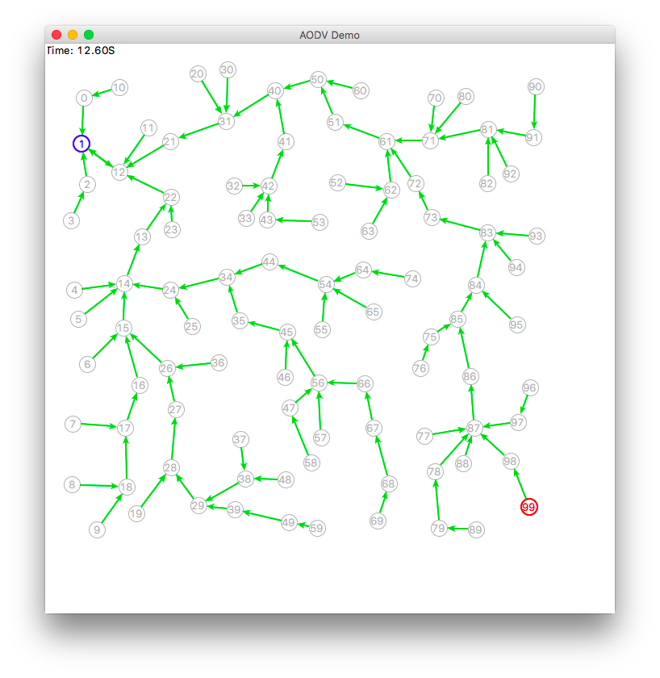
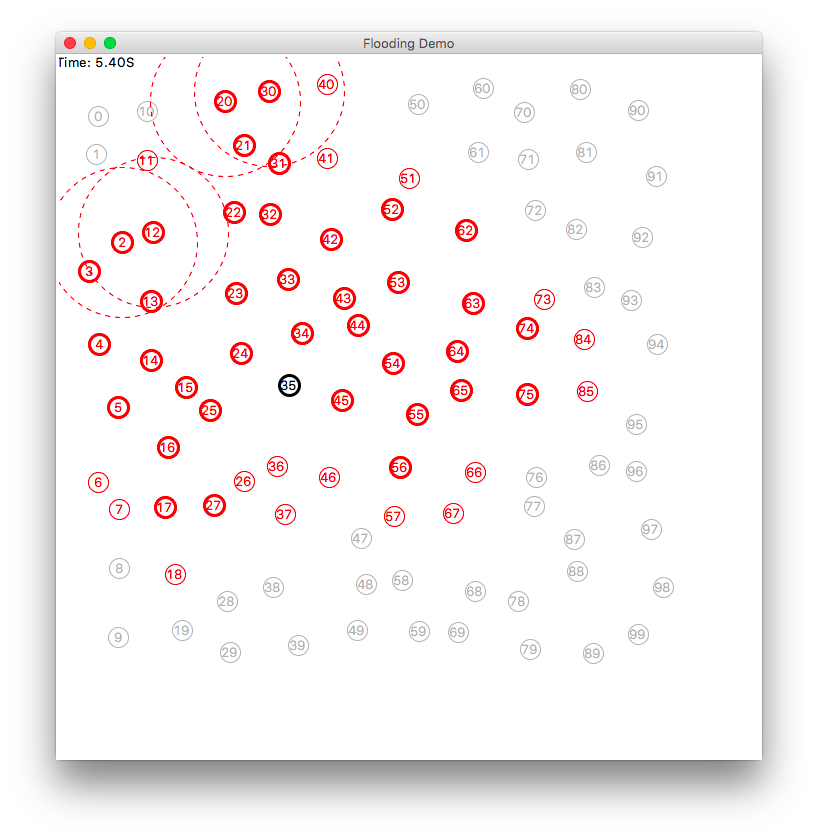

<div align="center">

# 📡 WSN Simulation (EE662)

### A discrete-event Wireless Sensor Network simulator in SimPy — from neighbor discovery and self-organizing cluster-trees to hybrid routing, failure recovery, and CC2420 energy modeling.

[](https://www.python.org/)
[](https://simpy.readthedocs.io/)
[](https://docs.python.org/3/library/tkinter.html)
[](#)

**[Overview](#overview) · [What's Inside](#-whats-inside) · [Final Project](#-final-project-parts-18) · [Run Locally](#-run-locally)**

</div>

---

## Overview

This is the umbrella coursework repository for **EE662 Wireless Sensor Networks** (M.S. Computer Engineering, SDSU). It bundles three layers of work: a base SimPy simulation framework (`wsnsimpy`), a self-organizing cluster-tree assignment (`wsnlab`), and an incrementally built 8-part final project (`final-project`) that layers up a full WSN protocol stack. Every simulation is discrete-event and ships with a live Tkinter topology view.

Because it consolidates several earlier submissions, this repo is a superset — the standalone `WSN-Midterm-2` and `WSN-Final-Project` repos are subsets of what lives here.

## 📦 What's Inside

| Directory | What it contains |
|---|---|
| `wsnsimpy/` | Base SimPy WSN framework — `Node`/`Simulator` classes and a Tk topology renderer (`topovis/`), plus reference examples (AODV, flooding, and layered variants). |
| `wsnlab/` | Assignment 2 — a self-organizing cluster-tree WSN: data-collection tree formation, network repair after failures, metrics analysis, and scenario/failure test scripts. |
| `final-project/` | EE662 final project, Parts 1–8 (`example_p1..p8` + `config_p1..p8`), plus `wsn_enhanced.py` (a single parametric simulation) and the modular `configs_p8/` config package. |
| `img/` | Topology-visualization screenshots (AODV, flooding). |

## 🧩 Final Project (Parts 1–8)

Each part builds directly on the previous one, growing a cluster-tree WSN into a complete, configurable protocol stack.

| Part | Focus | Highlights |
|---|---|---|
| **P1** | Neighbor Discovery | One-hop and two-hop neighbor tables via HELLO messages and neighbor-table sharing; LQI/RSSI estimates, entry aging, Appendix B fields. |
| **P2** | Cluster-Tree Tables | Appendix B & C table structures — neighbors, members (dict-based `MemberEntry`), and child-network entries. |
| **P3** | Hybrid Mesh-Tree Routing | Mesh forwarding when the destination is a 1/2-hop neighbor, tree routing otherwise; join-time, packet-delay, and path-trace metrics. |
| **P4** | Configurable Parameters | Max cluster members, per-cluster TX power (with min/max bounds), and configurable packet loss. |
| **P5** | Minimal Overlap & Migration | CH spacing via `MIN_CH_DISTANCE`, `ROUTER` bridge nodes for inter-cluster traffic, and CH handoff/migration. |
| **P6** | Failure Recovery | Random node failures and recovery, orphan detection, and automatic re-join / network repair. |
| **P7** | Cluster Optimization | Cluster merging, load balancing across CHs, and energy-aware CH rotation. |
| **P8** | Modular Refactor | Part 7 reorganized behind a modular `configs_p8/` config package (simulation, node, routing, reliability, cluster, failure, optimization, export). |

`wsn_enhanced.py` is a single parametric simulation (driven by `config_enhanced.py`) that pulls the above together — multi-hop neighbor tables, packet timestamping and path tracing, hybrid mesh-tree routing, configurable clusters and packet loss, minimal overlap with ROUTER bridging, CH handoff, failure recovery, cluster optimization, and a **CC2420** radio energy model.

## 🖼️ Screenshots

Topology visualizations rendered by the SimPy/Tkinter framework for the `wsnsimpy` reference protocols.

<p align="center">
  
  
</p>

<div align="center"><sub>AODV reactive routing (left) · flooding propagation (right)</sub></div>

## 🧪 Tech Stack

| Layer | Tool |
|---|---|
| Language | Python 3 |
| Simulation | SimPy (discrete-event simulation) |
| Visualization | Tkinter topology renderer (`topovis/`) |
| Energy model | CC2420 radio parameters |

## 🚀 Run Locally

```bash
git clone https://github.com/dishasawantt/wsn-simulation-ee662.git
cd wsn-simulation-ee662
pip install simpy
```

**Assignment 2 (cluster-tree WSN):**

```bash
cd wsnlab
python run_complete_simulation.py
```

**A final-project part (P1–P8):**

```bash
cd final-project
python example_p1.py    # neighbor discovery
# ...through example_p8.py (cluster optimization)
```

> **Note:** `final-project` scripts import from `wsnlab/source/`. Run from the repo root or ensure `source/` is on your `PYTHONPATH`.

## 🗂️ Consolidated From

These standalone repos are subsets of this monorepo:

| Archived repo | Lives here as |
|---|---|
| `WSN-Midterm-2` | `wsnlab/` + `wsnsimpy/` |
| `WSN-Final-Project` | `final-project/` |

---

<div align="center">

### Disha Sawant
**AI Application Engineer** · M.S. Computer Engineering @ SDSU

[](https://dishasawantt.github.io/resume)
[](https://linkedin.com/in/disha-sawant-7877b21b6)
[](https://github.com/dishasawantt)
[](mailto:dishasawantt@gmail.com)

</div>
